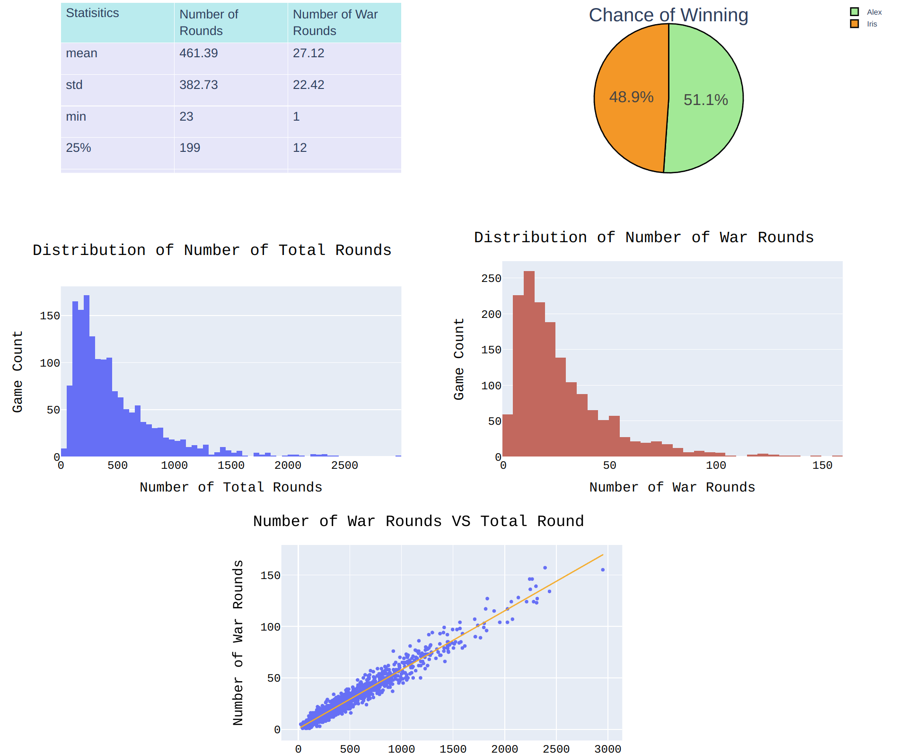
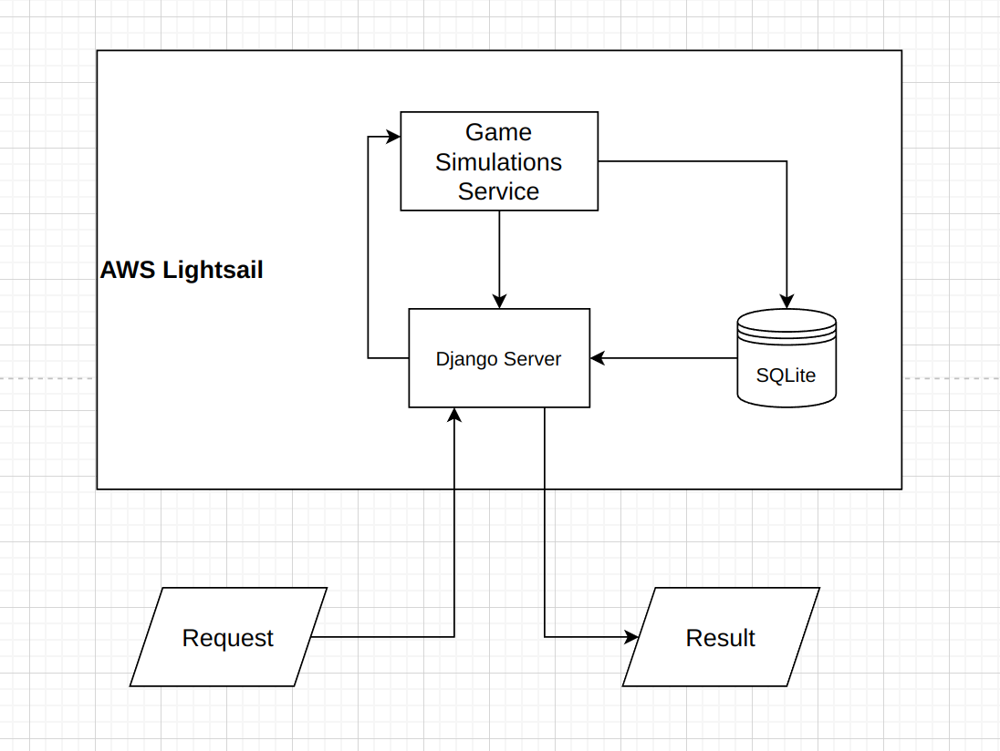
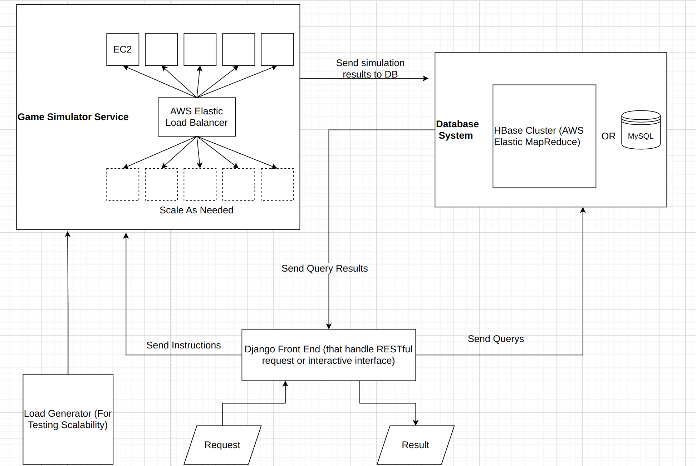

## RESTful Endpoints
### Endpoint for run simulation of the card game
Both endpoint are accessible using "GET" method
```sh
http://54.201.247.15:8000/simulation/v1/usernamex/<str:player name>/usernamey/<str:player name>/noshowhistory
#or get result with the game history
http://54.201.247.15:8000/simulation/v1/usernamex/<str:player name>/usernamey/<str:player name>/showhistory
```
Example without history (you can copy it to a browser to run or using curl): http://54.201.247.15:8000/simulation/v1/usernamex/Alex/usernamey/Iris/noshowhistory
<br>
Return:
```sh
{"winner": "Alex", "number_of_rounds": 117, "number_of_war_rounds": 7}
```
Example with history (you can click it to run): http://54.201.247.15:8000/simulation/v1/usernamex/Alex/usernamey/Iris/showhistory
<br>
Return:
```sh
#since it show the full history of the game, it is very long output, here I only show the top several lines.
{"winner": "Alex", "number_of_rounds": 735, "number_of_war_rounds": 41, "game_history": {"0": {"round_num": 0, "Alex": "black-clubs_5->black-clubs_2->black-clubs_A....", "Iris": "black-clubs_4->black-clubs_6->red-hearts_4->black-spades_8->red-diamonds_J->black-spades_k->red-hearts_k->red-diamonds ...}
```

Example without history: http://54.201.247.15:8000/simulation/v1/usernamex/Alex/usernamey/Iris/showhistory 
<br>
Return:
```sh
{"winner": "Alex", "number_of_rounds": 117, "number_of_war_rounds": 7}
```

### Endpoint to get lifetime wins for each player
```sh
http://54.201.247.15:8000/lifetimewin/v1/username/<str:player name>
```
Example: http://54.201.247.15:8000/lifetimewin/v1/username/Iris
<br>
Example Return:
```sh
{"username": "Iris", "number_of_wins": 1136}
```

## Additional APIs that I implemented
### Endpoint to run multiple game simulations
```sh
http://54.201.247.15:8000/simulations/v1/usernamex/<str:player name>/usernamey/<str:player name>/<int:number of simulation to run>
```
Example: http://54.201.247.15:8000/simulations/v1/usernamex/Alex/usernamey/Iris/10
<br>
Example Return:
```sh
[{"winner": "Alex", "number_of_rounds": 147, "number_of_war_rounds": 11}, {"winner": "Iris", "number_of_rounds": 127, "number_of_war_rounds": 5}, {"winner": "Alex", "number_of_rounds": 494, "number_of_war_rounds": 28}, {"winner": "Alex", "number_of_rounds": 363, "number_of_war_rounds": 23}, {"winner": "Iris", "number_of_rounds": 174, "number_of_war_rounds": 12}, {"winner": "Iris", "number_of_rounds": 798, "number_of_war_rounds": 52}, {"winner": "Iris", "number_of_rounds": 1265, "number_of_war_rounds": 79}, {"winner": "Alex", "number_of_rounds": 186, "number_of_war_rounds": 22} ...]
```

Note: Since I am using a single core server and currently no autoscaling is configured, if you give it a large number, it may take very long time to run and cause time out. 

### Endpoint to visualize the simulation result between two players
Imagine you want to do some analysis on the simulations result for two players, this API provide basic plotting and tables. It is updated based on the database, and if you run new simulation, refreshing the page will give you updated result.
```sh
http://54.201.247.15:8000/visualization/v1/usernamex/<str:player name>/usernamey/<str:player name>
```
Example: http://54.201.247.15:8000/visualization/v1/usernamex/Alex/usernamey/Iris
<br>
Example Return: a page with interactive plots and chart


## Error Handling
Due to time limitation, I am not able to set up all cases for error handling. But I set up one error handling example.

Imagine Alex and Iris are playing the game, and they are assigned to exactly the same card in the same order
Using only 8 cards in total as an example:
-Alex's deck : 2, 3, 4, A
-Iris's deck : 2, 3, 4, A
They will enter the war, and the players run out of cards, but the game has no result. In this case:
```sh
# define an new exception
class OutOfCardError(Exception): pass

...

try:
    run simulation
except OutOfCardError:
    return HttpResponse("Game Simulation Failed: run out of cards", status=204)
```
## Run the Framework locally
Currently, the service is already deployed at the AWS Lightsail and you can test using above links without install local iustallation
For running locally, following these steps:
```sh
pip install pandas statsmodel
pip install plotly==5.10.0
python -m pip install Django

git clone https://github.com/fanfanwu9898/wargame_simulator
cd wargame_simulator 
python manage.py makemigration game_simulator
python manage.py migrate game_simulator
python manage.py runserver
```
## Current Design and Future Improvement (that I wish that I have time to make)
Due to time/budget limitation, I have to deploy my service using AWS Lightsail, which is a great tool for quick prototyping and deployment, but not meant for scalable production. 


If time allows, I will implement a more robust production-level autoscalling-enabled cloud service, which can utilize EC2 instances from AWS. SQLite can be replaced by MySQL or PostgreSQL:


Other Improvements could be made:
- I can have better database design for storing game history.
 Currently the history of each simulation is recorded by using long strings to represent the card deck of each player. This obviously violate the third normal form of database design. There is much better way to design the table for shorter query time and less space consumption.
- I can implement interactive UI that integrate existing Plotly visualization using React framework.
- At this moment, the service is using the Django development server. For production ready, I will configure Nginx server. 
- Add logs and error handling mechanism.
- Add script for create AWS instances programmatically and Dockerfile/ Helm Charts (Kubernete) for deploying the service.
##### Thank you for reading, and feel free to contact me via yifanwu3@cs.cmu.edu if you have any question
